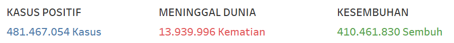
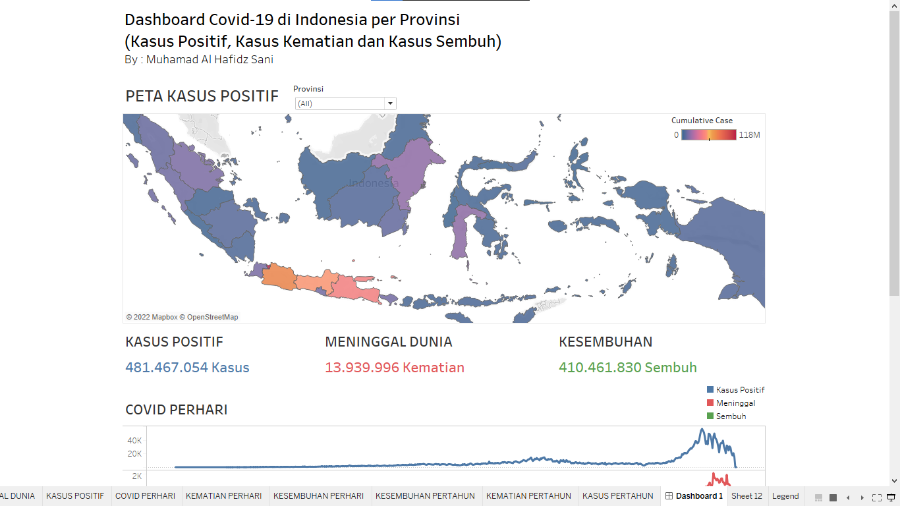

<!--
*** Thanks for checking out the Best-README-Template. If you have a suggestion
*** that would make this better, please fork the repo and create a pull request
*** or simply open an issue with the tag "enhancement".
*** Don't forget to give the project a star!
*** Thanks again! Now go create something AMAZING! :D
-->

<!-- PROJECT SHIELDS -->
<!--
*** I'm using markdown "reference style" links for readability.
*** Reference links are enclosed in brackets [ ] instead of parentheses ( ).
*** See the bottom of this document for the declaration of the reference variables
*** for contributors-url, forks-url, etc. This is an optional, concise syntax you may use.
*** https://www.markdownguide.org/basic-syntax/#reference-style-links
-->

<!-- PROJECT LOGO -->
 

  

  <h3 align="center">Dashboard Covid-19</h3>

  

    Visualisasi Dashboard Interaktif Untuk Pemantauan Kasus Covid-19 di Tingkat Nasional Menggunakan Aplikasi Tableau
     
    <a href="https://s.stis.ac.id/dashboard_221910726"><strong>Explore the dashboard »</strong></a>
     
     
    <a href="https://s.stis.ac.id/dashboard_221910726">Dashboard</a>
    ·
    <a href="https://github.com/hafidz-sani/dashboard-covid19">Github</a>
    ·
    <a href="https://drive.google.com/file/d/1W7SWxq6RDZHiJFSYvFjRI7GezELk4pCV/view?usp=sharing">Docs</a>
  

<!-- TABLE OF CONTENTS -->

  
Table of Contents

  <ol>
    <li>
      <a href="#abstrak">Abstrak</a>
      <ul>
        <li><a href="#built-with">Built With</a></li>
      </ul>
    </li>
    <li><a href="#pengumpulan-data">Pengumpulan Data</a></li>
    <li><a href="#pre-processing-data">Pre-processing Data</a></li>
    <li>
      <a href="#visualisasi-data">Visualisasi Data</a>
      <ul>
        <li><a href="#peta-kasus-positif">Peta Kasus Positid</a></li>
        <li><a href="#total-kasus">Total Kasus</a></li>
        <li><a href="#tren-covid-perhari">Tren Covid Perhari</a></li>
        <li><a href="#kasus-pertahun">Kasus Pertahun</a></li>
      </ul>
    </li>
    <li>
      <a href="#pembuatan-dashboard-interaktif">Pembuatan Dashboard Interaktif</a>
      <ul>
        <li><a href="#action-filter-:-filtering-by-map">Action Filter : Filtering by Map</a></li>
        <li><a href="#tableau-public">Tableau Public</a></li>
      </ul>
    </li>
  </ol>

<!-- ABOUT THE PROJECT -->
## Abstrak

_Covid-19_ sebagai epidemik menyebabkan kekhawatiran kepada masyarakat dunia, begitu juga masyarakat di Indonesia. Masyarakat memerlukan sebuah platform yang memudahkannya untuk mengakses informasi seputar _Covid-19_ dengan cepat dan informatif. Maka dibuatkan sebuah _dashboard_ visualisasi interaktif untuk menampilkan informasi _Covid-19_ seputar Kasus Positif, Kasus Kematian dan Kasus Sembuh berdasarkan Provinsi di Indonesia Tingkat Nasional. 

Data yang digunakan didapat dari [kaggle](https://www.kaggle.com/datasets/riqulaziz/case-vaccination-covid19-indonesia-dataset) berisi data _Covid-19_ di Indonesia. _Dashboard_ dibuat menggunakan aplikasi `Tableau Desktop`. _Dashboard_ dibuat interaktif berdasarkan 8 worksheet diantaranya Peta Kasus Positif, Total Kasus, Covid Perhari dan Kasus Pertahun. 

_Dashboard_ juga ditampilkan pada tableau public, sehingga masyarakat secara mudah bisa melihat _dashboard_ visualisasi hanya bermodalkan internet. _Dashboard_ dapat diakses secara publik melalui [tautan](https://s.stis.ac.id/dashboard_221910726) berikut.

<!-- 
(<a href="#top">back to top</a>)
 -->
 

### Built With

Pada bagian ini akan dijabarkan berbagai _tools_ yang digunakan dalam pembuatan _dashboard_ visualisasi interaktif _Covid-19_.

* [Tableau](https://www.tableau.com/)
* [Tableau Public](https://public.tableau.com/en-us/s/)
* [Kaggle](https://www.kaggle.com/)

 

<!-- GETTING STARTED -->
## Pengumpulan Data

Data dikumpulkan melalui situs [kaggle.com](https://www.kaggle.com/datasets/riqulaziz/case-vaccination-covid19-indonesia-dataset) yang menyediakan banyak _dataset_. Data yang diambil adalah data Kasus _Covid-19_ di Indonesia. Data ini memiliki 11 variabel diantaranya sebagai berikut.

| Variabel | Tipe Data |
| --- | --- |
| `date` | _Date_ |
| `province` | _Categorical_ |
| `daily case` | _Integer_ |
| `daily death` | _Integer_ |
| `daily recovered` | _Integer_ |
| `active case` | _Integer_ |
| `cumulative case` | _Integer_ |
| `cumulative death` | _Integer_ |
| `cumulative recovered` | _Integer_ |
| `cumulative active case` | _Integer_ |

 

## Pre-processing Data

Data yang dikumpulkan tidak sepenuhnya bisa menampilkan visualisasi yang diinginkan. Perlu dilakukan pra-pemrosesan data agar visualisasi data dapat dilakukan semestinya. Dalam membuat peta tematik, memerlukan sebuah variabel `longitude` dan `latitude` yang di-generate agar menampilkan peta dunia. 

Selanjutnya, variabel provinsi memiliki 34 kategori yang unik didalamnya. Salah satu kategorinya yaitu _Daerah Istimewa Yogyakarta_. Kategori ini tidak terdeteksi oleh `latitude` dan `longitude` yang di-generate dikarenakan penamaan kategori tidak sesuai dengan semestinya yaitu _DI Yogyakarta_. Maka dari itu, dengan software _tableau desktop_, kami gantikan kategori _Daerah Istimewa Yogyakarta_ menjadi _DI Yogyakarta_. Sehingga peta tematik bisa dibuat untuk seluruh provinsi di Indonesia.

 

## Visualisasi Data

### Peta Kasus Positif

Visualisasi data ini menampilkan peta tematik berdasarkan jumlah kasus kumulatif positif Covid-19. Peta ini ditampilkan melalui variabel _latitude_ yang diletakkan di bagian _rows_ dan _longitude_ yang diletakkan di bagian _columns_.

Berikutnya, variabel 'province' diletakkan ke menu marks sebagai _tooltip_, sehingga jika provinsi di Indonesia di-_hover_ maka akan memberikan memberikan keterangan nama provinsi dan total kasus per provinsi.

Selanjutnya meletakkan variabel `Cumulative Case` ke menu _marks_ dengan ukuran jumlah kasus kumulatif sebagai _color_. Hal ini akan memberikan warna pada tiap provinsi berdasarkan total kasus positifnya.

  

 

### Total Kasus

Teks sederhana dapati ditampilkan dengan menyeret variabel `Cumulative Case` ke menu _marks_ sebagai _text_. Sehingga, menampilkan total kasus positif Covid-19 berbentuk teks. Teks sederhana ini juga menampilkan total kasus meninggal dan total kasus yang sembuh, sehingga dibuat menjadi 3 _worksheet_.

  

 

### Tren Covid Perhari

Grafik garis ditujukan untuk menampilkan tren kasus Covid-19. Untuk menampilkannya, pertama, meletakkan variabel Date ke bagian columns dan mengaturnya dalam day. Lalu meletakkan variabel Daily Case, Daily Death dan Daily Recovered ke bagain rows dan mengatur ukurannya kedalam jumlah. Grafik garis diberikan 3 warna berbeda diantaranya biru menandakan kasus positif, merah menandakan kasus kematian dan hijau menandakan kasus sembuh.

  

 

### Kasus Pertahun

Untuk menggambarkan kasus positif, meninggal dan sembuh per tahun dapat menggunakan _bar chart_. _Bar chart_ sesuai digunakan dalam melakukan komparasi nilai berdasarkan kategori. 
Untuk menampilkannya, awalnya menyeret variabel `Date` ke bagian _columns_ dalam ukuran tahun. Lalu menyeret variabel `Daily Case` ke bagian _rows_ berdasarkan jumlah. Sehingga dihasilkan grafik batang dengan dua kategori yaitu 2020 dan 2021. Visualisasi ini diterapkan juga untuk kasus meninggal dan kasus sembuh.

  

 

## Pembuatan Dashboard Interaktif

_Dashboard_ dibuat dengan judul _Dashboard_ _Covid-19_ di Indonesia per Provinsi (Kasus Positif, Kasus Kematian dan Kasus Sembuh). _Dashboard_ dibuat dengan ukuran _fixed_ dan _Custom_ dimana lebarnya 1000px dan tingginya 1200px.

Sebelumnya telah dibuat sebanyak 8 _worksheet_ diantaranya yaitu Peta Kasus Positif yang ditampilkan dalam peta tematik, Total Kasus Positif, Total Meninggal Dunia dan Total Sembuh yang ditampilkan dalam Teks Sederhana, Covid-19 Perhari yang ditampilkan dalam _line chart_ serta Kasus Pertahun, Kematian Pertahun dan Kesembuhan Pertahun yang ditampilkan dalam _bar chart_. Setelah 8 _worksheet_ dibuat, _dashboard_ bisa dibuat dengan menggabungkan kedelapan _worksheet_ tersebut.

  

  

 

### Action Filter : Filtering by Map

Peta juga ditambahkan _actions_ yang diberi nama `Filtering by Map`. _Action_ ini berguna untuk memberikan _filter_ berdasarkan provinsi yang diklik pada peta. Setiap provinsi yang dipilih di peta, maka seluruh visualisasi data akan menyesuaikan berdasarkan provinsi yang dipilih. Sehingga memudahkan pengguna dalam mencari informasi per provinsinya.

  

 

### Tableau Public

Untuk melihat secara langsung _dashboard_ yang telah dibuat, maka akan ditampilkan dalam situs yang disediakan **tableau** secara gratis, yaitu **tableau public**. Untuk mengakses _dashboard_ dapat melalui [s.stis.ac.id/dashboard_221910726](https://s.stis.ac.id/dashboard_221910726).

<!-- CONTACT -->
## Contact

Muhamad Al Hafidz Sani - [@hafidzsani39](https://www.linkedin.com/in/hafidzsani39/) - 221910726@stis.ac.id

Project Link: [https://github.com/hafidz-sani/dashboard-covid19](https://github.com/hafidz-sani/dashboard-covid19)

(<a href="#top">back to top</a>)
